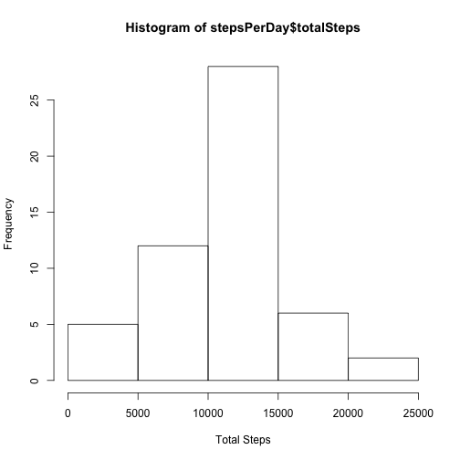
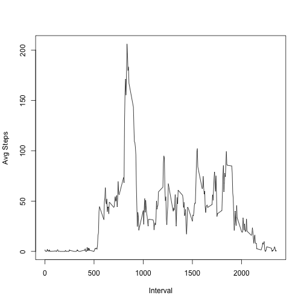
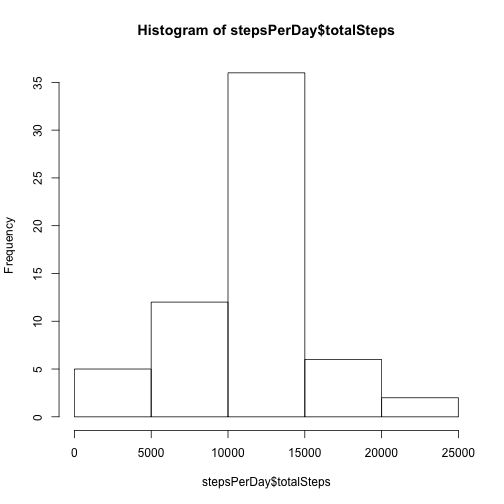
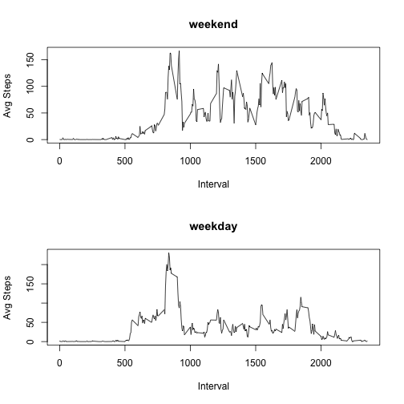

# Reproducible Research: Peer Assessment 1


## Loading and preprocessing the data

```r
# load data
activityData <- read.csv("activity.csv")
# remove rows with NA values for steps column
activiyDataNoNA <- na.omit(activityData)
```


## What is mean total number of steps taken per day?

Below is a histogram that plots the total number of steps taken each day.

```r
library(plyr)
stepsPerDay <- ddply(activiyDataNoNA, .(date), summarise, totalSteps = sum(steps))
hist(stepsPerDay$totalSteps, xlab = "Total Steps")
```

 


Now let's calculate the mean and median of the total number of steps taken per day.


```r
meanTotalStepsPerDay <- mean(stepsPerDay$totalSteps)
medianTotalStepsPerDay <- median(stepsPerDay$totalSteps)
```


The mean of the total number of steps taken per day is 10766.19.  

The median of the total number of steps taken per day is 10765.  

## What is the average daily activity pattern?

Below is a time series plot of the average number of steps per 5-minute time interval. The averages are calculated accross all days.


```r
avgStepsPerInterval <- ddply(activiyDataNoNA, .(interval), summarise, avgSteps = mean(steps))
plot(avgStepsPerInterval$interval, avgStepsPerInterval$avgSteps, type = "l", 
    xlab = "Interval", ylab = "Avg Steps")
```

 


Now let's find the interval on average with the most steps.


```r
intervalWithMaxSteps <- avgStepsPerInterval[avgStepsPerInterval$avgSteps == 
    max(avgStepsPerInterval$avgSteps), 1]
```


On average the interval with the most steps is the interval 835.

## Imputing missing values

We are going to estimate how the missing values in the original data affect the results we get back.  

First we will calculate the total number of missing values in the original dataset.

```r
numNAValues <- nrow(activityData[is.na(activityData$steps), ])
```


So the total number of rows with missing steps values is 2304.

Next, we will fill in estimates for the missing steps values. We are going to fill in any missing steps value with the mean value over all days for that interval.


```r
newActivityData <- activityData
for (i in 1:nrow(newActivityData)) {
    row <- newActivityData[i, ]
    
    if (is.na(row$steps)) {
        # steps is an NA value so get the avg steps for time interval
        newActivityData[i, "steps"] <- avgStepsPerInterval[avgStepsPerInterval$interval == 
            row$interval, "avgSteps"]
    }
}
```


Now we will plot another histogram of the number of steps taken each day but using this new data with missing values filled in:


```r
stepsPerDay <- ddply(newActivityData, .(date), summarise, totalSteps = sum(steps))
hist(stepsPerDay$totalSteps)
```

 


And again we will calculate the mean and median of the total steps per day with the new data with missing values filled in:


```r
meanTotalStepsPerDay <- mean(stepsPerDay$totalSteps)
medianTotalStepsPerDay <- median(stepsPerDay$totalSteps)
```


The new mean of the total number of steps taken per day is 10766.19.  

And the new median of the total number of steps taken per day is 10766.19.  

As you can see the new mean after imputing missing values is the same as the previous mean calculated when we removed all NA values.  

The new median however differs slightly and is now the same as the mean because we filled in missing data with the mean and now that the mean is actually in the dataset it becomes the new median.

## Are there differences in activity patterns between weekdays and weekends?


First we need to convert the "date" column into vector of type "Date". Then we need to create a factor variable with the levels "weekday" and "weekend" so we can tell whether each row is a date that falls during the weekday or is on the weekend.


```r
dates <- as.Date(newActivityData$date)
weekdayOrWeekendFunc <- function(x) {
    w = weekdays(x)
    if (w == "Sunday" || w == "Saturday") {
        "Weekend"
    } else {
        "Weekday"
    }
}
newActivityData$weekdayOrWeekend <- sapply(dates, weekdayOrWeekendFunc)
```


Now we will plot the number of steps taken per interval for both weekdays and weekends.


```r
# Find all rows that are weekday dates and calculate averages
weekdayRows <- newActivityData[newActivityData$weekdayOrWeekend == "Weekday", 
    ]
avgStepsPerIntervalWeekday <- ddply(weekdayRows, .(interval), summarise, avgSteps = mean(steps))

# Find all rows that are weekend dates and calculate averages
weekendRows <- newActivityData[newActivityData$weekdayOrWeekend == "Weekend", 
    ]
avgStepsPerIntervalWeekend <- ddply(weekendRows, .(interval), summarise, avgSteps = mean(steps))

# Now plot seperately weekend and weekday averages per time interval
par(mfrow = c(2, 1))
plot(avgStepsPerIntervalWeekend$interval, avgStepsPerIntervalWeekend$avgSteps, 
    xlab = "Interval", ylab = "Avg Steps", type = "l", main = "weekend")
plot(avgStepsPerIntervalWeekday$interval, avgStepsPerIntervalWeekday$avgSteps, 
    xlab = "Interval", ylab = "Avg Steps", type = "l", main = "weekday")
```

 

